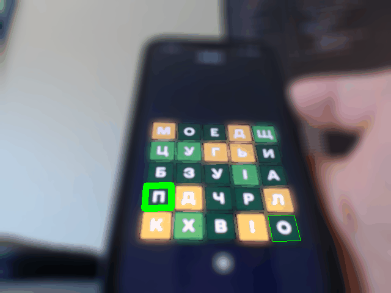

# літералі-помічник
Помічник гри в ["літералі"](https://apps.apple.com/ua/app/%D0%BB%D1%96%D1%82%D0%B5%D1%80%D0%B0%D0%BB%D1%96/id1639535151?l=uk).

Це іграшковий проект, зроблений з ціллю покращити мій результат в "літералі", а також погратись з PyTorch. Це мій перший досвід використання PyTorch та OpenCV, так що я б не радив брати прикладів з цього коду :)

## Важливі скрипти
* **literali_assistant.py** - запускає сам помічник. Знімає відео з веб-камери, намагається розпізнати там телефон з запущеною "літералі" та підказувати слова, якщо вийде. Натискання клавіші P вмикає режим паузи, в якому вибране слово буде підсвічене літера за літерою. Повторне натискання P скидає режим паузи.
* **sample_generator.py** - скрипт, який допомагає набрати велику кількість прикладів літер для того щоб тренувати модель. Знімає відео з веб-камери, намагається розпізнати там телефон з запущеною "літералі", і якщо знайшов усі 25 квадратів - зберігає їх (розкидуючи в директорії з іменами від 0 до 24 в залежності від позиції). Якщо запустити цей скрипт і крутити перед ним телефон з літералі, то можна швидко набрати багато прикладів для різних літер. Звісно ж вводити ніякі слова при цьому не потрібно, щоб на кожній позиції лишалась та сама літера. Після цього з вихідних директорій, семпли можна перекинути руками в директорії від а до я.
* **train_char_net.ipynb** - код тренування моделі. Вся логіка ШІ взята з  https://pytorch.org/tutorials/beginner/deep_learning_60min_blitz.html.
